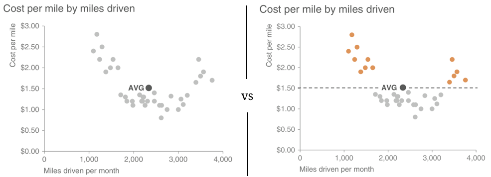
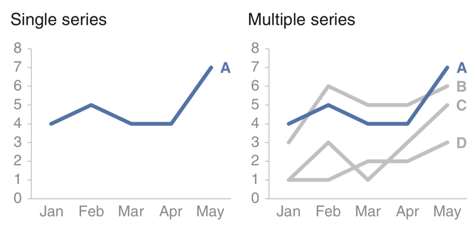

layout: true

<div class="my-footer">
  <span style="text-align:center">
    <span> 
      
    </span>
    <a href="https://therbootcamp.github.io/">
      <span style="padding-left:82px"> 
        <font color="#7E7E7E">
          www.therbootcamp.com
        </font>
      </span>
    </a>
    <a href="https://therbootcamp.github.io/">
      <font color="#7E7E7E">
       Explorative Datenanalyse mit R | Februar 2020
      </font>
    </a>
    </span>
  </div> 

---

```{r setup, include=FALSE}
options(htmltools.dir.version = FALSE)
# see: https://github.com/yihui/xaringan
# install.packages("xaringan")
# see: 
# https://github.com/yihui/xaringan/wiki
# https://github.com/gnab/remark/wiki/Markdown
options(width=110)
options(digits = 4)
```

```{r, echo = FALSE ,message = FALSE, warning = FALSE}
knitr::opts_chunk$set(comment=NA, fig.width=6, fig.height=6, echo = TRUE, eval = TRUE, 
                      message = FALSE, warning = FALSE, fig.align = 'center', dpi = 200)
library(tidyverse)
library(ggthemes)
library(extrafont)
library(gridExtra)
#loadfonts()
```

# Storytelling mit Daten

.pull-left55[

<ul>
  <li class="m1"><span>Kontext verstehen</span></li>
  <ul class="level">
    <li><span>Wer ist die Audience, was müssen sie wissen?</span></li>
  </ul>
  <li class="m2"><span><high>Passende Darstellungsart</high></span></li>
  <ul class="level">
    <li><span>Welche Darstellungsart dient der intendierten Aussage am meisten?</span></li>
  </ul>
  <li class="m3"><span>Eliminiere Wirrwarr</span></li>
  <ul class="level">
    <li><span>Gibt es unnötige Komplexität?</span></li>
  </ul>
  <li class="m4"><span>Fokus setzen</span></li>
  <ul class="level">
    <li><span>Nutze Grösse, Farben, Positionen um Aufmerksamkeit zu lenken</span></li>
  </ul>
  <li class="m5"><span>Denke wie ein Designer</span></li>
  <ul class="level">
    <li><span>Bediene dich bewährten Prinzipien aus dem Design</span></li>
  </ul>
  <li class="m6"><span>Erzähle eine Geschichte</span></li>
  <ul class="level">
    <li><span>Spanne einen Bogen über Anfang, Mitte, Ende</span></li>
  </ul>
</ul>

]


.pull-right35[

<p align="center">
<br>
<font style="font-size:10px">from <a href="https://www.modernanalyst.com/Resources/BusinessAnalystHumor/tabid/218/ID/3516/Data_Analysis_Conclusions.aspx">modernanalyst.com</a></font>
</p>

]

---

# Text

.pull-left2[

When you have just a number or two that you want to communicate:
use the numbers directly.

]


.pull-right7[
<br><br>
<p align="center">
<br>
<font style="font-size:10px">adapted from <a href="http://www.storytellingwithdata.com/">storytellingwithdata.com</a></font>
</p>

]


---

# Tables

.pull-left2[

Tables interact with the verbal system and are often quite demanding. 

Help the reader by moving borders to the background and by using colors. 

]


.pull-right7[
<p align="center">
<br>
<font style="font-size:10px">adapted from <a href="http://www.storytellingwithdata.com/">storytellingwithdata.com</a></font>
</p>

]

---

# Graphs

.pull-left2[

Tables interact with the visual system.

A well‐designed graph will typically get the information across more quickly than a well‐designed table.

Help the reader by moving borders to the background and by using colors. 

]


.pull-right7[
<p align="center">
<br>
<font style="font-size:10px">adapted from <a href="http://www.storytellingwithdata.com/">storytellingwithdata.com</a></font>
</p>

]

---

.pull-left2[

# Scatterplot

Good for relationships

Can use color to direct attention.

]


.pull-right7[
<br>
<p align="center">
<br>
<font style="font-size:10px">adapted from <a href="http://www.storytellingwithdata.com/">storytellingwithdata.com</a></font>
</p>

]


---

# Lines

.pull-left2[

Good single variables across, e.g., time.

X-axis must be spaced evenly. 
]


.pull-right7[
<br><br>
<p align="center">
<br>
<font style="font-size:10px">adapted from <a href="http://www.storytellingwithdata.com/">storytellingwithdata.com</a></font>
</p>

]

---

# Slopes

.pull-left2[

Good for displaying changes across two sets of observations.  

Can be overwhelming when slopes overlap too much. 

Color can direct focus. 

]


.pull-right7[
<p align="center">
<br>
<font style="font-size:10px">adapted from <a href="http://www.storytellingwithdata.com/">storytellingwithdata.com</a></font>
</p>

]


---

# Bars

.pull-left2[

Bar charts should be leveraged because they are common.   

Zero-baseline critical. 

Follow natural order of categories.

]


.pull-right7[
<p align="center">
<br>
<font style="font-size:10px">adapted from <a href="http://www.storytellingwithdata.com/">storytellingwithdata.com</a></font>
</p>

]


---

# Horizontal bars

.pull-left2[

Easier too read 


]


.pull-right7[
<p align="center">
<br><br>
<br>
<font style="font-size:10px">adapted from <a href="http://www.storytellingwithdata.com/">storytellingwithdata.com</a></font>
</p>

]


---

class: middle, center

<h1><a href="https://therbootcamp.github.io/EDA_2019CSS/_sessions/PlottingII/PlottingII_practical.html">Practical</a></h1>